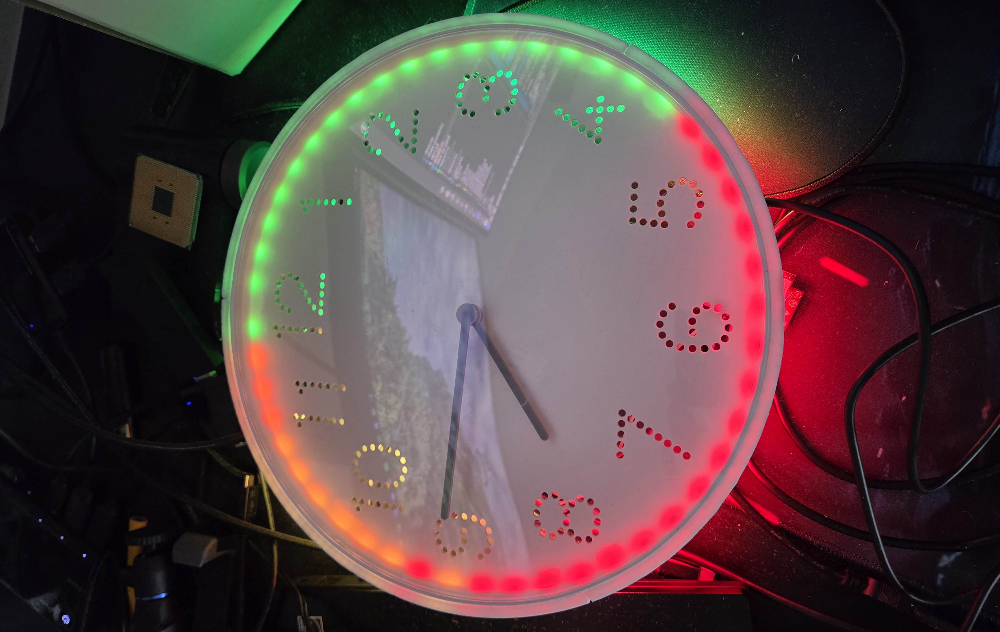
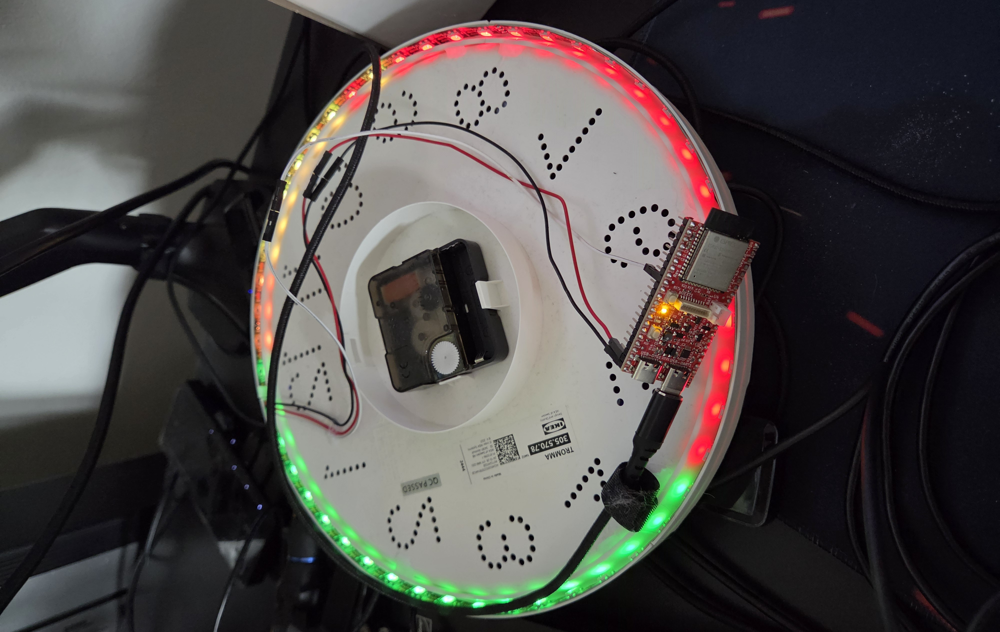
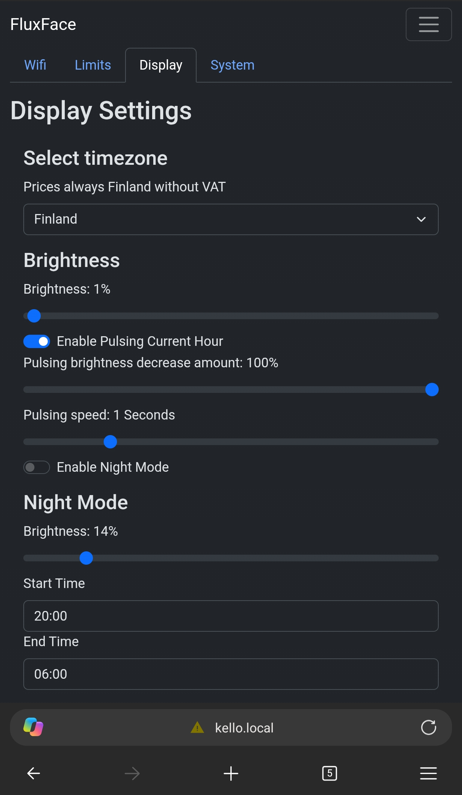
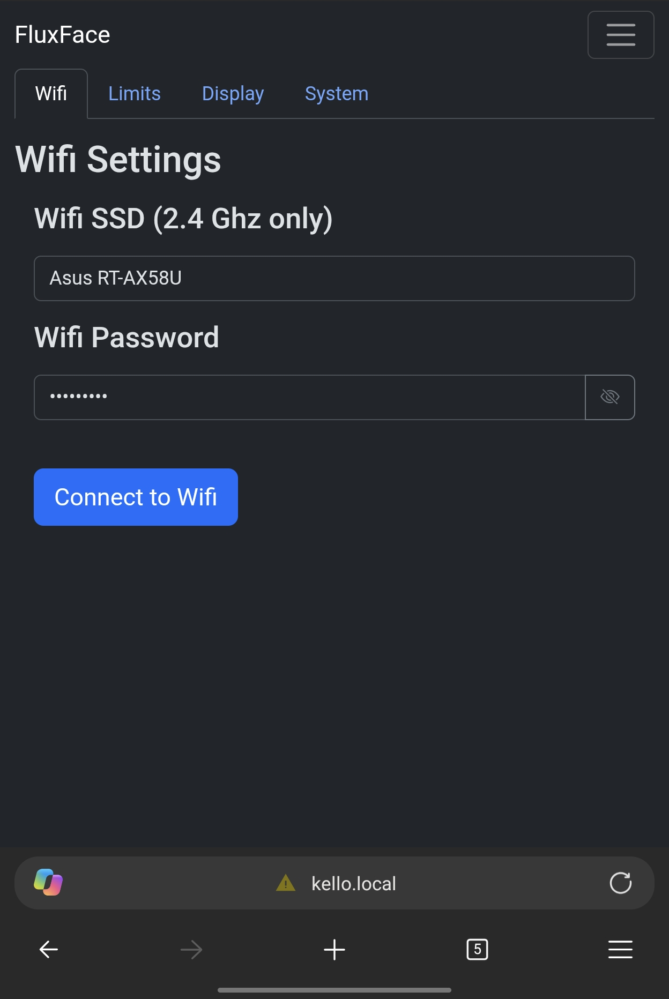
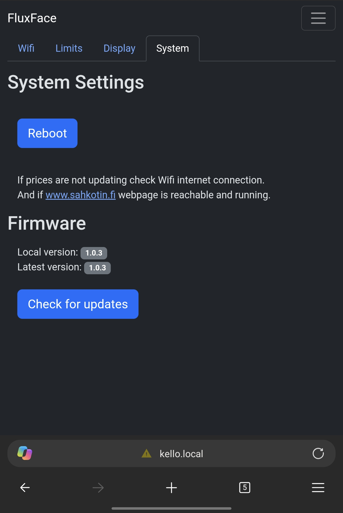
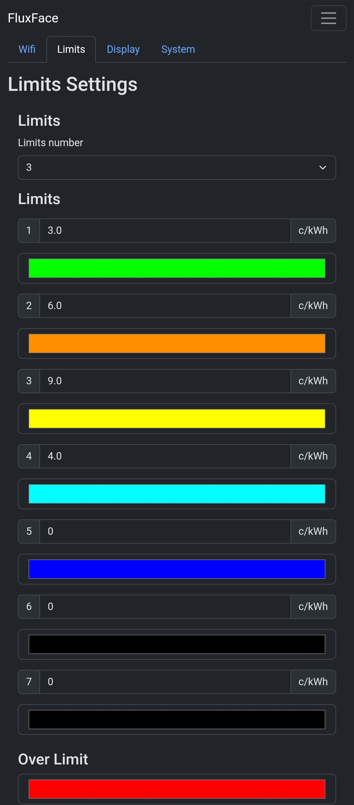

# FluxFace

FluxFace is an ESP32-based smart LED display that visualizes electricity price levels on an RGBW LED strip. It connects to Wi‑Fi, fetches pricing data, keeps time in sync, and lights the strip according to configured thresholds so you can quickly see when electricity is cheap or expensive at a glance.

This project is designed for a GitHub audience: it is small, self-contained, and aimed at makers who want a practical embedded project built on ESP-IDF and a browser-based configuration interface.

## Gallery

<p align="center">
  
  
</p>

<p align="center">
  
  
</p>

<p align="center">
  
  
</p>

## Overview

- Reads electricity price data and stores it locally for the next 48 hours.
- Drives a 48-LED SK6812-compatible strip using the ESP32 RMT peripheral.
- Uses Wi‑Fi station mode for normal operation and an embedded access point for setup.
- Serves a lightweight web interface from the onboard LittleFS partition for configuration.
- Supports firmware updates over the air (OTA) and uses SNTP for clock synchronization.
- Includes night mode, pulsing effects, and configurable price thresholds.

## Hardware

The firmware is built around an ESP32/ESP32-S3 class device and a 5V-powered SK6812-compatible LED strip.

Typical setup:

- ESP32 or ESP32-S3 development board (the Olimex ESP32-S3-WROOM-1-N8R8 has 8 MB flash)
- 48-LED RGBW LED strip (for example SK6812)
- 5V power supply sized for the strip
- Data wire connected to GPIO 16
- Common ground between the controller and the LED strip

## Project structure

- `main/` — application firmware, Wi‑Fi handling, REST API, pricing logic, and LED rendering
- `www/` — static files served by the device for local configuration
- `build/` — generated ESP-IDF build output
- `sdkconfig.defaults` — tracked ESP-IDF defaults, including the 8 MB flash size and custom `partitions.csv` layout
- `sdkconfig` and `CMakeLists.txt` — local/generated and project build configuration
- `version.txt` — firmware version used for OTA checks

## Getting started

### Prerequisites

Install ESP-IDF **v5.5.1** and configure your environment according to the official ESP-IDF documentation. This project requires that version.

### Build

From the project root:

```bash
idf.py set-target esp32s3
idf.py build
```

If your hardware uses a different ESP32 variant, adjust the target accordingly.

The generated `sdkconfig` is intentionally not tracked. Project-wide defaults are kept in `sdkconfig.defaults`, which is tracked and configures the 8 MB flash size and custom partition table required by this project. ESP-IDF uses these defaults when generating the local `sdkconfig`; existing local selections are preserved.

### Flash

```bash
idf.py flash
```

### Monitor logs

```bash
idf.py monitor
```

## Configuration and usage

After boot, the device initializes Wi‑Fi and starts a local web interface.

Use the browser UI to:

- connect the device to your home Wi‑Fi network
- adjust LED limits and thresholds
- configure night mode
- tune pulse behavior and display settings
- review price data and update status

The web assets are stored in the `www/` directory and are served from the device filesystem.

## Development notes

This project uses the ESP-IDF framework and integrates a few common embedded features:

- FreeRTOS tasks for LED updates and price processing
- LittleFS for local web assets
- HTTP server endpoints for remote configuration and status reporting
- OTA update support for sending newer firmware images to the device
- SNTP synchronization so display behavior stays aligned with local time

## License

This project is licensed under the **PolyForm Noncommercial License 1.0.0**.

You are free to use, study, modify, and distribute the software for noncommercial purposes, including personal projects, hobby projects, research, experimentation, and testing.

**Commercial use is not permitted under this license.**

Commercial use includes incorporating this software, or substantial parts of it, into a product or service that is offered for commercial advantage or monetary compensation.

**Commercial licensing is available. Please contact the copyright holder to discuss commercial use and licensing options.**

See the full license:

https://polyformproject.org/licenses/noncommercial/1.0.0

Copyright © 2026 Markus Järvisalo
